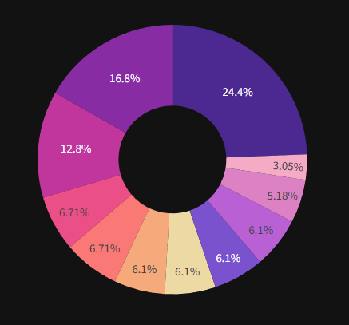

# FinPro

# 💼 Personal Finance Dashboard

A modern, dark-themed personal finance dashboard built with **Python**, **Streamlit**, and **Plotly**.  
Easily track income, expenses, savings, and visualize spending habits with interactive charts.

---

## 🖼️ Screenshots

<!-- Add screenshots of your dashboard below -->

---

## 🚀 Features

- 📊 Track income and expenses with categories
- 🌙 Stylish dark mode with interactive UI
- 📅 Filter by month
- 📈 View spending trends via charts (line, pie)
- 🧾 Editable CSV-based transaction storage
- 💰 Set and monitor savings goals
- 💻 Built with Streamlit and Plotly Express

---

## 🛠 Tech Stack

| Tool        | Use                                |
|-------------|-------------------------------------|
| Python      | Core programming language           |
| Streamlit   | Web UI framework                    |
| Plotly      | Interactive data visualization      |
| Pandas      | Data handling and filtering         |

---

## 📂 Folder Structure

